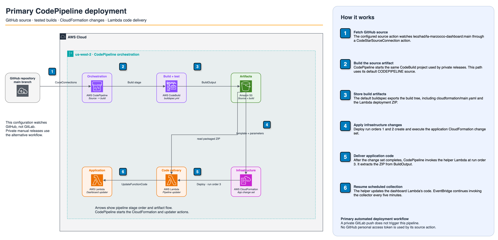

# Design Document

> Historical design record from the original implementation. The [README](../../../README.md) is the maintained description of the current dashboard.

## Overview

The La Marzocco Dashboard is a serverless web application built on AWS that monitors La Marzocco espresso machines through the La Marzocco Cloud API. The system uses an event-driven architecture with Lambda functions triggered by EventBridge on a 5-minute schedule, generating static HTML/JSON content served globally via CloudFront CDN.

## Architecture

The maintained architecture diagrams below replace the original text sketches. Implementation details after this section describe the original design; see the [README](../../../README.md) for current behavior.

### Runtime and data flow


[Editable draw.io source](../../../docs/application-architecture.drawio)

### Alternative private release workflow


[Editable draw.io source](../../../docs/cicd-pipeline-architecture.drawio) · [Release guide](../../../docs/deployment.md)

### Primary CodePipeline workflow



[Editable draw.io source](../../../docs/github-pipeline-architecture.drawio)

## Components and Interfaces

### 1. Lambda Function (LaMarzoccoDashboard Class)

**Purpose**: Orchestrates data collection, HTML generation, S3 upload, and CloudFront invalidation.

**Key Methods**:
- `__init__()`: Initialize AWS clients (S3, Secrets Manager, CloudFront) and environment variables
- `get_or_create_installation_key()`: Manage installation key persistence in S3
- `get_credentials()`: Retrieve La Marzocco credentials from Secrets Manager
- `collect_machine_data()`: Collect comprehensive data from La Marzocco Cloud API
- `generate_dashboard_html()`: Generate HTML dashboard using Jinja2 template
- `upload_to_s3()`: Upload HTML and JSON files to S3 bucket
- `invalidate_cloudfront()`: Selectively invalidate CloudFront paths
- `run()`: Main execution orchestrator with smart invalidation logic

**AWS Client Interfaces**:
- `boto3.client('s3')`: S3 operations (upload, cache storage/retrieval)
- `boto3.client('secretsmanager')`: Credential retrieval
- `boto3.client('cloudfront')`: Cache invalidation

**External API Interface**:
- `LaMarzoccoCloudClient`: pylamarzocco library for API communication
- `LaMarzoccoMachine`: Machine-specific data retrieval

### 2. Smart Invalidation System

**Purpose**: Reduce CloudFront invalidation costs by only invalidating when content actually changes.

**Key Methods**:
- `get_content_hash()`: Generate SHA256 hash of content
- `get_cached_hash()`: Retrieve previous content hash from S3
- `store_cached_hash()`: Store current content hash in S3
- `has_content_changed()`: Compare current and cached hashes
- `normalize_machine_data_for_comparison()`: Remove timestamp fields for comparison

**Cache Storage**:
- Location: S3 bucket `.cache/` folder
- Files: `dashboard-html-hash`, `dashboard-json-hash`, `installation_key.json`
- Format: Plain text SHA256 hashes

### 3. Data Collection Pipeline

**Purpose**: Collect comprehensive machine data from La Marzocco Cloud API with robust error handling.

**Data Flow**:
1. Retrieve credentials from Secrets Manager
2. Get or create installation key from S3
3. Initialize LaMarzoccoCloudClient with credentials and key
4. Register device if needed (first-time setup)
5. List machines and select first machine
6. Collect dashboard, settings, schedule, and statistics data
7. Parse widget data for specific information
8. Build comprehensive machine data dictionary
9. Return data or fallback data on error

**Widget Parsing**:
- `CMMachineStatus`: Power status and mode
- `CMCoffeeBoiler`: Coffee boiler temperature and status
- `CMSteamBoilerTemperature`: Steam boiler status
- `CMBackFlush`: Cleaning status and last cleaning date
- `ThingScale`: Scale connection and battery
- `CMPreBrewing`: Pre-brewing mode settings
- `CMBrewByWeightDoses`: Dose configuration
- `LAST_COFFEE`: Recent shot history
- `COFFEE_AND_FLUSH_COUNTER`: Lifetime totals

### 4. HTML Dashboard Generator

**Purpose**: Generate responsive, mobile-friendly HTML dashboard with embedded CSS and JavaScript.

**Template Engine**: Jinja2 with embedded template string

**Key Features**:
- Responsive grid layout (auto-fit, minmax 300px)
- Dark theme with brown gradient background
- Matrix-style coffee emoji animation (toggleable)
- Chart.js visualizations (pie chart, bar chart)
- Auto-refresh countdown timer
- Local timezone conversion for timestamps
- Touch-friendly interactions for mobile
- Coffee emoji favicon

**CSS Architecture**:
- Mobile-first responsive design
- Breakpoints: 768px, 480px, 320px
- Landscape orientation handling
- Touch device detection
- High DPI display support

### 5. CloudFormation Infrastructure

**Main Stack Resources**:
- S3 bucket with website configuration
- CloudFront distribution with OAC
- Route53 A record (alias to CloudFront)
- Lambda function with EventBridge trigger
- IAM roles with least privilege
- CloudWatch log group
- Custom resources (random suffix, hosted zone lookup, ACM certificate)

**Pipeline Stack Resources**:
- CodePipeline with 3 stages (Source, Build, Deploy)
- CodeBuild project for Lambda packaging
- CodeStar Connection for GitHub
- S3 artifacts bucket
- Secrets Manager secret for La Marzocco credentials
- Lambda function for code updates
- IAM roles for pipeline execution

## Data Models

### Machine Data Structure

```python
{
    'machine_info': {
        'name': str,                    # Machine name
        'model': str,                   # Model name
        'serial_number': str,           # Serial number
        'firmware_version': str,        # Gateway and Machine firmware
        'connected': bool,              # Connection status
        'connection_date': str,         # ISO timestamp
        'image_url': str                # Machine image URL
    },
    'status': {
        'power_on': bool,               # Power status
        'mode': str,                    # Operating mode
        'coffee_boiler_temp': float,    # Temperature in Fahrenheit
        'coffee_boiler_ready': bool,    # Ready indicator
        'coffee_boiler_range': str,     # Temperature range
        'steam_boiler_status': str,     # Steam boiler status
        'steam_boiler_enabled': bool,   # Steam boiler enabled
        'scale_connected': bool,        # Scale connection
        'scale_battery': int,           # Battery percentage
        'scale_name': str,              # Scale model name
        'scale_calibration_required': bool
    },
    'statistics': {
        'total_shots': int,             # Lifetime shot count
        'total_flushes': int,           # Lifetime flush count
        'last_cleaning': str            # ISO timestamp
    },
    'brewing': {
        'pre_brewing_mode': str,        # Pre-brewing mode
        'pre_brewing_available': list,  # Available modes
        'dose_mode': str,               # Dose mode
        'dose_1': float,                # Dose A setting (grams)
        'dose_2': float,                # Dose B setting (grams)
        'dose_range': str               # Dose range
    },
    'recent_shots': [
        {
            'time': int,                # Unix milliseconds
            'extraction_seconds': float,
            'dose_value': float,        # Grams
            'dose_mode': str,
            'dose_index': str
        }
    ],
    'settings': {
        'wifi_ssid': str,
        'wifi_signal': int,             # dBm
        'plumbed_in': bool,
        'auto_update': bool,
        'smart_standby_enabled': bool,
        'smart_standby_minutes': int
    },
    'maintenance': {
        'cleaning_status': str,
        'last_cleaning_date': str,      # YYYY-MM-DD
        'firmware_update_required': bool,
        'firmware_update_available': bool
    },
    'timestamp': str,                   # ISO timestamp
    'collection_method': str,
    'client_version': str
}
```

### Installation Key Model

```python
{
    'device_id': str,                   # UUID
    'device_name': str,
    'device_type': str,
    'installation_key': str             # Authentication token
}
```

### Content Hash Cache Model

```
S3 Key: .cache/dashboard-html-hash
Content: <sha256_hash_string>

S3 Key: .cache/dashboard-json-hash
Content: <sha256_hash_string>

S3 Key: .cache/installation_key.json
Content: <installation_key_json>
```

## Error Handling

### API Error Handling

**Strategy**: Multi-layer fallback approach

1. **Primary**: Normal API data collection
2. **Fallback 1**: Exception-based extraction from error messages
3. **Fallback 2**: Raw API call with manual parsing
4. **Fallback 3**: Static fallback data with error indicator

**Error Scenarios**:
- Authentication failures: Attempt device registration
- Statistics parsing errors: Extract from exception message
- Network timeouts: Return fallback data
- Missing widgets: Use default values

### CloudFormation Error Handling

**Custom Resources**: All custom resources implement proper error handling with cfnresponse

**Delete Operations**: Clean up resources (DNS records, certificates) on stack deletion

**Validation**: Template validation before deployment

### S3 Error Handling

**NoSuchKey Exceptions**: Return empty string for missing cache files

**Upload Failures**: Raise exception to trigger Lambda retry

### CloudFront Error Handling

**Invalidation Failures**: Log warning but don't fail execution (non-critical)

## Testing Strategy

### Local Testing

**Environment Setup**:
```bash
pip install -r requirements.txt
export S3_BUCKET_NAME=test-bucket
export LAMARZOCCO_SECRET_NAME=test-secret
export CLOUDFRONT_DISTRIBUTION_ID=test-distribution
python src/lambda_function.py
```

**Test Cases**:
- Credential retrieval from Secrets Manager
- Installation key generation and persistence
- Machine data collection with mock API
- HTML generation with sample data
- S3 upload simulation
- Content hash comparison

### Integration Testing

**Pipeline Testing**:
1. Push test commit to GitHub
2. Monitor CodePipeline execution
3. Verify CodeBuild package creation
4. Verify CloudFormation stack update
5. Verify Lambda function code update
6. Test dashboard functionality

**Dashboard Testing**:
1. Invoke Lambda function manually
2. Verify S3 content upload
3. Verify CloudFront serving
4. Test mobile responsiveness
5. Verify auto-refresh functionality
6. Test Matrix animation toggle

### Monitoring and Observability

**CloudWatch Logs**:
- Lambda execution logs: `/aws/lambda/la-marzocco-dashboard-updater`
- CodeBuild logs: `/aws/codebuild/la-marzocco-deployment-pipeline-build`

**Key Metrics**:
- Lambda execution duration
- Lambda error rate
- CloudFront cache hit ratio
- S3 request count
- CloudFront invalidation count

**Log Patterns**:
- "Content changed" vs "Content unchanged"
- "CloudFront invalidated" vs "skipping CloudFront invalidation"
- "Successfully parsed statistics"
- "Statistics parsing failed, extracting from error"

## Security Considerations

### Credential Security
- Credentials stored in AWS Secrets Manager (encrypted at rest)
- IAM role-based access (no hardcoded credentials)
- Secrets never logged or exposed
- Installation keys persisted in S3 (not in logs)

### Network Security
- HTTPS only via CloudFront and ACM
- S3 bucket not publicly accessible (CloudFront OAC)
- CloudFront Origin Access Control for S3 access
- TLS 1.2+ minimum protocol version

### IAM Security
- Least privilege IAM policies
- Resource-specific ARNs where possible
- Separate roles for Lambda, CodeBuild, CodePipeline, CloudFormation
- No wildcard permissions except where required

### Application Security
- No user authentication (single-user dashboard)
- No data modification capabilities
- Read-only API access
- No sensitive data in HTML/JSON output

## Performance Optimization

### Lambda Optimization
- Memory: 512 MB (optimal for package size)
- Timeout: 300 seconds (5 minutes)
- Cold start mitigation: Reuse AWS clients
- Async/await for I/O operations

### Content Delivery Optimization
- CloudFront caching: 5 minutes for HTML, 1 minute for JSON
- Gzip compression enabled
- HTTP/2 enabled
- IPv6 enabled
- PriceClass_100 (North America and Europe)

### Cost Optimization
- Smart invalidation: Only invalidate on content changes
- Content hashing: SHA256 comparison
- Cache persistence: S3 storage for hashes
- Result: 90% reduction in invalidation costs

### Caching Strategy
- **HTML Cache**: 5 minutes (DefaultTTL: 300)
- **JSON Cache**: 1 minute (DefaultTTL: 60)
- **Browser Cache**: No-cache, must-revalidate
- **Content Hashing**: SHA256 for change detection

## Deployment Strategy

### GitOps Workflow

**Deployment Trigger**: Git push to main branch

**Pipeline Stages**:
1. **Source**: CodePipeline detects GitHub changes via CodeStar Connection
2. **Build**: CodeBuild packages Lambda with dependencies using buildspec.yml
3. **Deploy**: CloudFormation creates/updates stack, Lambda function updated

**Rollback Strategy**: Git revert + push triggers automatic rollback

### Infrastructure as Code

**Templates**:
- `cloudformation/main.yaml`: Application infrastructure
- `cloudformation/pipeline.yaml`: CI/CD pipeline infrastructure

**Parameters**:
- `cloudformation/parameters.json`: Application parameters
- `cloudformation/pipeline-parameters.json`: Pipeline parameters

**Custom Resources**:
- Random suffix generator (unique resource names)
- Hosted zone lookup (Route53 zone discovery)
- ACM certificate manager (us-east-1 for CloudFront)

### Secrets Management

**Shared Secret Architecture**:
```
Pipeline Stack (Creates) → Main Stack (References) → Lambda (Reads)
```

**Secrets**:
1. La Marzocco credentials (shared): Created by pipeline, used by Lambda
2. GitHub token: Pre-existing, used by CodePipeline

## Technology Decisions

### Why Serverless?
- No server management overhead
- Automatic scaling
- Pay-per-use pricing
- High availability (AWS SLA)
- Zero maintenance

### Why Lambda?
- Event-driven execution (EventBridge trigger)
- Stateless operation (perfect for data collection)
- Cost-effective for periodic tasks
- Easy integration with AWS services

### Why S3 + CloudFront?
- Static hosting (no server needed)
- Global CDN (fast worldwide access)
- SSL termination (HTTPS)
- Cost-effective for low traffic
- High availability

### Why GitOps?
- Automated deployments
- Version control for infrastructure
- Audit trail for changes
- Consistent deployment process
- Easy rollback

### Why Jinja2?
- Powerful template engine
- Embedded CSS/JavaScript support
- Conditional rendering
- Loop support for data iteration
- Familiar syntax

### Why Smart Invalidation?
- 90% cost reduction on CloudFront invalidations
- Maintains real-time updates when needed
- Simple implementation (SHA256 hashing)
- Transparent to users

## Alternative Approaches Considered

### Static Site Generator (Rejected)
- **Pros**: Simpler architecture
- **Cons**: No dynamic data collection, requires separate data source

### API Gateway + Lambda (Rejected)
- **Pros**: RESTful API, more flexible
- **Cons**: Higher cost, more complex, unnecessary for single-user dashboard

### EC2 Instance (Rejected)
- **Pros**: More control, traditional architecture
- **Cons**: Server management, higher cost, lower availability

### DynamoDB for Historical Data (Deferred)
- **Pros**: Historical trends, analytics
- **Cons**: Increased complexity and cost, not needed for MVP

### Multi-Machine Support (Deferred)
- **Pros**: Support multiple machines
- **Cons**: Increased complexity, authentication challenges, not needed for MVP

## Future Enhancements

### Potential Features
- Historical data storage in DynamoDB
- Multi-machine support with user authentication
- Alerting via SNS/SES for maintenance needs
- Mobile app integration
- Advanced analytics and trends
- Custom dashboard themes
- Export data to CSV/Excel
- Integration with other coffee equipment

### Scalability Considerations
- DynamoDB for state management
- Step Functions for orchestration
- API Gateway for REST API
- Cognito for user management
- Multi-region deployment
- Backup and disaster recovery
