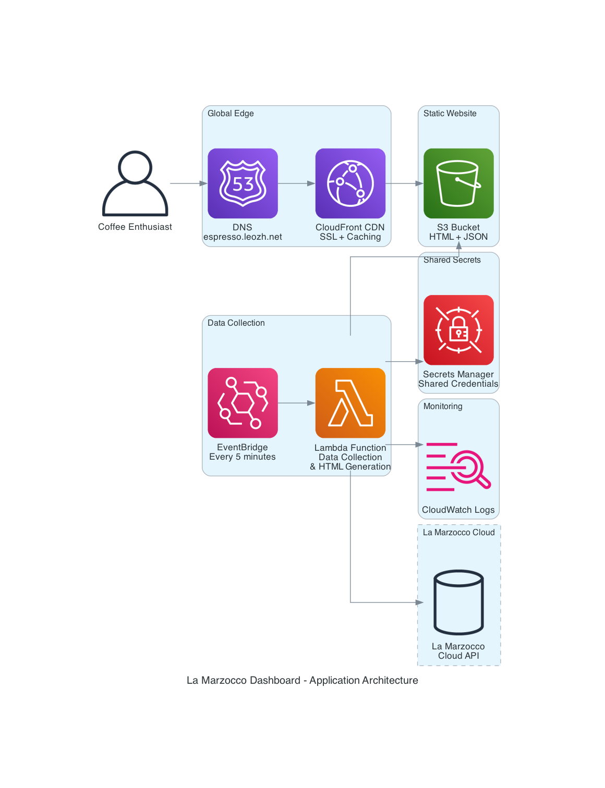
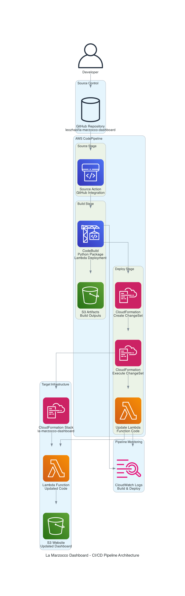

# La Marzocco Dashboard

A serverless web dashboard for monitoring your La Marzocco espresso machine, built with AWS Lambda and the La Marzocco Cloud API.



## Features

- **Real-time machine status** (power, temperature, water level)
- **Usage statistics** (total shots, flushes, last activity)
- **Machine settings** (auto on/off, dosing preferences)
- **Maintenance alerts** (descaling, cleaning needed)
- **Beautiful dark theme** optimized for coffee shops
- **Auto-refresh** every 5 minutes
- **JSON API endpoint** for integrations
- **Mobile responsive** design

## Benefits

- **🚀 Serverless**: No servers to manage, scales automatically
- **💰 Cost Effective**: Pay only when function runs (~$2.75/month with smart invalidation)
- **🔒 Secure**: Credentials in AWS Secrets Manager, HTTPS only
- **⚡ Fast**: Global CDN with CloudFront
- **🔄 Automated**: Updates every 5 minutes automatically via GitOps
- **📱 Responsive**: Works on desktop and mobile
- **🛠️ Zero Maintenance**: Fully AWS managed infrastructure
- **🧠 Smart Caching**: Only invalidates CloudFront when content changes (90% cost savings)

## Architecture

### Application Architecture

The dashboard uses a serverless architecture with the following components:

- **EventBridge**: Triggers Lambda function every 5 minutes
- **Lambda**: Collects data from La Marzocco API and generates HTML
- **S3**: Hosts static website files (HTML + JSON)
- **CloudFront**: Global CDN with SSL termination
- **Route53**: DNS management for custom domain
- **Secrets Manager**: Secure storage for La Marzocco credentials
- **CloudWatch**: Logging and monitoring

### CI/CD Pipeline Architecture



The project uses GitOps for deployment:

1. **Developer** commits code to GitHub
2. **CodePipeline** automatically detects changes
3. **CodeBuild** packages Lambda function with dependencies
4. **CloudFormation** updates infrastructure and Lambda code
5. **Dashboard** is automatically updated

## Quick Start

### Prerequisites

1. **Compatible La Marzocco Machine**: Any La Marzocco machine or grinder with cloud connectivity ([see compatibility list](https://support-iot.lamarzocco.com/faq/))
2. **La Marzocco Account**: Cloud account with machine registered
3. **AWS Account**: AWS account with appropriate permissions configured
4. **Domain**: Route53 hosted zone for your domain
5. **Tools**: AWS CLI, Python 3.11+, jq (for JSON parsing)

### 1. Setup Environment

```bash
cd ~/git/la-marzocco-dashboard
cp .env.example .env
```

Edit `.env` with your credentials:
```bash
AWS_REGION=<your-aws-region>
DOMAIN_NAME=<your-domain-name>
```

**Note**: La Marzocco credentials are stored securely in AWS Secrets Manager, not in `.env` files.

### 2. Deploy CI/CD Pipeline

```bash
# Set your AWS profile and region
export AWS_PROFILE=<your-profile-name>
export AWS_REGION=<your-aws-region>

# Deploy the CodePipeline
./deploy-pipeline.sh
```

This creates the CI/CD pipeline that will automatically deploy your application from GitHub.

### 3. Configure Secrets in AWS Secrets Manager

The pipeline uses two secrets stored in AWS Secrets Manager:

#### **La Marzocco Credentials** (Created by Pipeline)
After the pipeline is deployed, you need to add your La Marzocco credentials:

```bash
# Find your La Marzocco secret name
aws secretsmanager list-secrets \
  --region $AWS_REGION \
  --query 'SecretList[?contains(Name, `lamarzocco-credentials`)].Name' \
  --output text

# Update the secret with your La Marzocco credentials
aws secretsmanager update-secret \
  --secret-id <secret-name-from-above> \
  --secret-string '{"username":"your-lamarzocco-username","password":"your-lamarzocco-password"}' \
  --region $AWS_REGION
```

#### **GitHub Token** (Pre-existing)
The pipeline also requires a GitHub personal access token for repository access:

```bash
# Check if GitHub token secret exists
aws secretsmanager describe-secret \
  --secret-id la-marzocco-github-token \
  --region $AWS_REGION

# If it doesn't exist, create it with your GitHub token
aws secretsmanager create-secret \
  --name la-marzocco-github-token \
  --description "GitHub token for pipeline access" \
  --secret-string '{"token":"your-github-personal-access-token"}' \
  --region $AWS_REGION
```

**GitHub Token Requirements:**
- **Scope**: `repo` (Full control of private repositories)
- **Format**: Personal Access Token (classic)
- **Permissions**: Read access to your la-marzocco-dashboard repository

**Important**: Replace placeholders with your actual credentials:
- `<your-profile-name>`: Your AWS CLI profile name
- `<your-aws-region>`: Your deployment region  
- `your-lamarzocco-username`: Your La Marzocco Cloud email
- `your-lamarzocco-password`: Your La Marzocco Cloud password
- `your-github-personal-access-token`: Your GitHub PAT

**Note**: The pipeline creates a single shared La Marzocco secret that both the deployment process and the Lambda function use, avoiding duplicate credential storage.

### 4. Deploy Application (via Git)

```bash
# Make any changes to your code
git add .
git commit -m "Initial deployment"
git push origin main
```

The CodePipeline will automatically:
- Build the Lambda deployment package
- Deploy/update CloudFormation stack
- Update Lambda function code
- Refresh the dashboard

### 5. Access Dashboard

Visit `https://your-domain.com` (your configured domain)

## What Gets Created

### AWS Resources (via CloudFormation)
- **Lambda Function**: Data collection and HTML generation
- **EventBridge Rule**: Triggers function every 5 minutes
- **S3 Bucket**: Static website hosting
- **CloudFront Distribution**: Global CDN with SSL
- **Route53 Records**: DNS management
- **ACM Certificate**: SSL certificate
- **Secrets Manager**: Secure credential storage
- **IAM Roles**: Least privilege access
- **CloudWatch Logs**: Function monitoring

### CI/CD Resources
- **CodePipeline**: Automated deployment pipeline
- **CodeBuild**: Lambda package building
- **S3 Artifacts Bucket**: Build artifact storage
- **IAM Roles**: Pipeline execution permissions

### Monthly Cost: ~$2.75

**Smart CloudFront Invalidation Optimization**: The dashboard uses intelligent content change detection to only invalidate CloudFront when machine data actually changes, reducing invalidation costs by 90% (from ~$70/month to <$5/month).

## Smart CloudFront Invalidation

### Cost Optimization Overview
The dashboard implements intelligent CloudFront invalidation to dramatically reduce costs while maintaining real-time updates.

### How It Works
1. **Content Change Detection**: Compares SHA256 hashes of normalized machine data (excluding timestamps)
2. **Selective Invalidation**: Only invalidates CloudFront paths when content actually changes
3. **Cache Storage**: Stores content hashes in S3 `.cache/` folder for persistence across Lambda executions
4. **User Experience Preserved**: Display timestamps still update for freshness, but don't trigger unnecessary invalidations

### Cost Impact
- **Before Optimization**: 8,640 invalidations/month × 2 paths × $0.005 = **$76.40/month**
- **After Optimization**: ~5-10% of executions need invalidation = **$3-7/month**
- **Monthly Savings**: **$65-70/month (90%+ reduction)**
- **Annual Savings**: **$780-840/year**

### Technical Details
```python
# Smart invalidation logic
normalized_data = self.normalize_machine_data_for_comparison(machine_data)
if self.has_content_changed(html_content, self.html_cache_key):
    paths_to_invalidate.append('/index.html')
if self.has_content_changed(normalized_json, self.json_cache_key):
    paths_to_invalidate.append('/data.json')
```

### Monitoring
Check Lambda logs to see invalidation decisions:
```bash
aws logs filter-log-events \
  --log-group-name /aws/lambda/la-marzocco-dashboard-updater \
  --filter-pattern "invalidation" \
  --region $AWS_REGION
```

## Management

### View Pipeline Status
```bash
aws codepipeline get-pipeline-state \
  --name la-marzocco-deployment-pipeline-pipeline \
  --region $AWS_REGION
```

### View Application Logs
```bash
aws logs tail /aws/lambda/la-marzocco-dashboard-updater \
  --region $AWS_REGION \
  --follow
```

### Test Lambda Function
```bash
aws lambda invoke \
  --function-name la-marzocco-dashboard-updater \
  --payload '{}' \
  --region $AWS_REGION \
  response.json && cat response.json | jq .
```

### Manual Stack Operations (if needed)
```bash
# View stack status
aws cloudformation describe-stacks \
  --stack-name la-marzocco-dashboard \
  --region $AWS_REGION

# View stack resources
aws cloudformation list-stack-resources \
  --stack-name la-marzocco-dashboard \
  --region $AWS_REGION
```

### Delete Everything
```bash
./cleanup.sh
```

## Project Structure

```
la-marzocco-dashboard/
├── cloudformation/
│   ├── main.yaml              # Application CloudFormation template
│   ├── pipeline.yaml          # CI/CD pipeline CloudFormation template
│   ├── parameters.json        # Application stack parameters
│   └── pipeline-parameters.json # Pipeline stack parameters
├── src/
│   └── lambda_function.py     # Python Lambda function
├── generated-diagrams/        # Architecture diagrams
│   ├── application-architecture.png
│   └── cicd-pipeline-architecture.png
├── deploy-pipeline.sh         # Deploy CI/CD pipeline
├── deploy.sh                  # Manual deployment (legacy)
├── cleanup.sh                 # Complete cleanup
├── buildspec.yml              # CodeBuild specification
├── requirements.txt           # Python dependencies
├── .env.example              # Environment template
├── .gitignore                # Git ignore rules
├── README.md                 # This file
└── CHANGELOG.md              # Project change history
```

## Customization

### Update Frequency
Edit the EventBridge rule in `cloudformation/main.yaml`:
```yaml
DashboardScheduleRule:
  Properties:
    ScheduleExpression: 'rate(10 minutes)'  # Change from 5 minutes
```

Then commit and push: `git push origin main`

### Dashboard Styling
Edit the HTML template in `src/lambda_function.py` in the `generate_dashboard_html` method.

### Domain Configuration
1. Update `DOMAIN_NAME` in `.env`
2. Commit and push: `git push origin main`

## Data Collected

The dashboard displays comprehensive machine information:

```json
{
  "machine_info": {
    "name": "Linea Mini",
    "model": "Linea Mini", 
    "serial_number": "LM016332",
    "firmware_version": "Gateway: 1.2.3, Machine: 4.5.6",
    "connected": true,
    "connection_date": "2025-01-15T10:30:00Z",
    "image_url": "https://..."
  },
  "status": {
    "power_on": true,
    "mode": "BREWING_MODE",
    "coffee_boiler_temp": 201.2,
    "coffee_boiler_ready": true,
    "coffee_boiler_range": "190-210°F",
    "steam_boiler_status": "READY",
    "steam_boiler_enabled": true,
    "scale_connected": true,
    "scale_battery": 83,
    "scale_name": "LMZ-59BD90",
    "scale_calibration_required": false
  },
  "statistics": {
    "total_shots": 5051,
    "total_flushes": 1837,
    "last_cleaning": "2025-06-15T09:15:00Z"
  },
  "brewing": {
    "pre_brewing_mode": "PreInfusion",
    "pre_brewing_available": ["PreBrewing", "PreInfusion", "Disabled"],
    "dose_mode": "MassType",
    "dose_1": 20.0,
    "dose_2": 30.0,
    "dose_range": "5-100g"
  },
  "recent_shots": [
    {
      "time": 1751755324037,
      "extraction_seconds": 31.1,
      "dose_value": 20.3,
      "dose_mode": "MassType",
      "dose_index": "1"
    }
  ],
  "settings": {
    "wifi_ssid": "CoffeeShop-WiFi",
    "wifi_signal": -45,
    "plumbed_in": true,
    "auto_update": true,
    "smart_standby_enabled": true,
    "smart_standby_minutes": 30
  },
  "maintenance": {
    "cleaning_status": "READY",
    "last_cleaning_date": "2025-06-15",
    "firmware_update_required": false,
    "firmware_update_available": false
  },
  "timestamp": "2025-07-06T08:00:00Z",
  "collection_method": "La Marzocco Cloud API",
  "client_version": "pylamarzocco"
}
```

## Troubleshooting

### Pipeline Deployment Failed
```bash
# Check pipeline execution
aws codepipeline list-pipeline-executions \
  --pipeline-name la-marzocco-deployment-pipeline-pipeline \
  --region $AWS_REGION

# Check CodeBuild logs
aws logs filter-log-events \
  --log-group-name /aws/codebuild/la-marzocco-deployment-pipeline-build \
  --start-time $(date -d '1 hour ago' +%s)000 \
  --region $AWS_REGION
```

### Stack Deployment Failed
```bash
# Check what failed
aws cloudformation describe-stack-events \
  --stack-name la-marzocco-dashboard \
  --region $AWS_REGION \
  --query 'StackEvents[?ResourceStatus==`CREATE_FAILED`]'
```

### Lambda Function Not Working
```bash
# Check recent logs
aws logs filter-log-events \
  --log-group-name /aws/lambda/la-marzocco-dashboard-updater \
  --start-time $(date -d '1 hour ago' +%s)000 \
  --region $AWS_REGION
```

### Dashboard Not Loading
1. Wait 5-10 minutes for DNS/SSL propagation
2. Check CloudFront distribution status
3. Verify S3 bucket has content
4. Check Route53 DNS records

### Authentication Issues
1. Verify La Marzocco credentials in AWS Secrets Manager
2. Test credentials with La Marzocco mobile app
3. Check Secrets Manager console for credential updates

## Security

### Current Implementation
- ✅ Credentials stored in AWS Secrets Manager (encrypted at rest)
- ✅ HTTPS only via CloudFront and ACM
- ✅ S3 bucket not publicly accessible (CloudFront OAC)
- ✅ Lambda execution role with minimal permissions
- ✅ CloudFormation stack with least privilege IAM policies
- ✅ CodePipeline with secure artifact storage

### Security Best Practices
- Regularly rotate La Marzocco credentials in Secrets Manager
- Monitor CloudTrail for unusual API activity
- Enable AWS Config for compliance monitoring
- Set up billing alerts for cost anomalies
- Review IAM permissions in CloudFormation templates

## Cost Breakdown

### Monthly Costs (Approximate)
- **Lambda**: ~$0.20 (8,640 invocations × 2 seconds × $0.0000166667/GB-second)
- **EventBridge**: ~$0.09 (8,640 events × $1.00/million)
- **S3**: ~$0.02 (minimal storage and requests)
- **CloudFront**: ~$0.50 (assuming moderate traffic)
- **CloudFront Invalidations**: ~$0.05 (smart invalidation - only when content changes)
- **Secrets Manager**: ~$0.40 (1 secret)
- **Route53**: ~$0.50 (hosted zone)
- **CodePipeline**: ~$1.00 (1 active pipeline)
- **CodeBuild**: ~$0.05 (minimal build time)

**Total**: ~$2.81/month

**Cost Optimization**: Smart CloudFront invalidation reduces monthly costs by ~$65-70 compared to naive invalidation (90%+ savings on invalidation fees).

## API Endpoints

### Dashboard
- **URL**: `https://your-domain.com/`
- **Content**: Full HTML dashboard

### JSON Data
- **URL**: `https://your-domain.com/data.json`
- **Content**: Raw machine data in JSON format
- **Cache**: 1 minute TTL

## Development

### Local Testing
```bash
# Install dependencies
pip install -r requirements.txt

# Set environment variables
export S3_BUCKET_NAME=your-bucket
export LAMARZOCCO_SECRET_NAME=your-secret
export CLOUDFRONT_DISTRIBUTION_ID=your-distribution

# Test function locally
python src/lambda_function.py
```

### GitOps Workflow
1. **Make Changes**: Edit code, templates, or configuration
2. **Commit**: `git add . && git commit -m "Description"`
3. **Deploy**: `git push origin main`
4. **Monitor**: Check CodePipeline execution
5. **Verify**: Test dashboard functionality

## AWS Profile Usage

This project supports any AWS CLI profile configuration:

### Environment Variable Method (Recommended)
```bash
export AWS_PROFILE=<your-profile-name>
export AWS_REGION=<your-aws-region>
./deploy-pipeline.sh
```

### Per-Command Method
```bash
AWS_PROFILE=<your-profile-name> AWS_REGION=<your-aws-region> ./deploy-pipeline.sh
```

### Default Profile
If no profile is specified, scripts use your default AWS CLI profile and the region from your `.env` file.

## Support

### Project Documentation
- **README.md**: Complete project documentation (this file)
- **CHANGELOG.md**: Detailed change history and version information

### AWS Documentation
- [CloudFormation User Guide](https://docs.aws.amazon.com/cloudformation/)
- [Lambda Developer Guide](https://docs.aws.amazon.com/lambda/)
- [CodePipeline User Guide](https://docs.aws.amazon.com/codepipeline/)
- [EventBridge User Guide](https://docs.aws.amazon.com/eventbridge/)

### La Marzocco API
- [pylamarzocco Library](https://github.com/zweckj/pylamarzocco)

### Useful Commands
```bash
# Pipeline operations
aws codepipeline list-pipelines --region $AWS_REGION
aws codepipeline get-pipeline-state --name pipeline-name --region $AWS_REGION

# Stack operations
aws cloudformation list-stacks --region $AWS_REGION
aws cloudformation validate-template --template-body file://cloudformation/main.yaml

# Resource inspection
aws cloudformation list-stack-resources --stack-name la-marzocco-dashboard --region $AWS_REGION

# Monitoring
aws logs describe-log-groups --log-group-name-prefix /aws/lambda/la-marzocco --region $AWS_REGION
aws events list-rules --name-prefix la-marzocco --region $AWS_REGION
```

---

**Created by [Leo Zhadanovsky](https://github.com/leozhad/la-marzocco-dashboard)**

## License

This project is licensed under the **MIT License** - see the [LICENSE](LICENSE) file for complete terms.

### License Summary

The MIT License is a permissive open source license that provides you with:

#### ✅ **Permissions**
- **Commercial Use**: Use the software for commercial purposes
- **Modification**: Create derivative works and modifications
- **Distribution**: Share and redistribute the software
- **Private Use**: Use the software for private purposes

#### 📋 **Requirements**
- **License and Copyright Notice**: Include the original license and copyright notice with the software

#### ⚠️ **Limitations**
- **No Liability**: Authors are not liable for damages
- **No Warranty**: Software provided "AS IS" without warranties

### Contributing

By contributing to this project, you agree that your contributions will be licensed under the same MIT License. All voluntary contributions are welcome and will help improve the La Marzocco Dashboard for the entire community.

The MIT License is one of the most permissive and widely-used open source licenses, making this project easy to use, modify, and integrate into other projects.

**Enjoy your serverless La Marzocco dashboard!** ☕️
